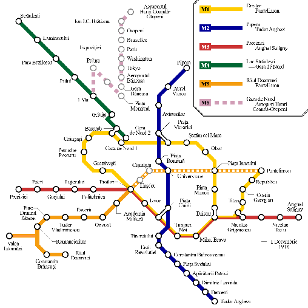

## Hiding Locations

This is an official map of the Bucharest Metro system. The [game map](../questions/#game-map) is based on this map and marks the valid game area.

Your final hiding location must be reachable from the station **without leaving and reentering your zone**.

If your final hiding location is **outdoors**, it must be **within 3 metres of a path marked on Google Maps**.

**This rule does not apply if you are hiding indoors**. However, **you may not hide inside a business** (e.g. a shop, restaurant, cafe, pub, cinema, casino or hotel) or a **hospital**.

You must ensure that your hiding location is **publicly accessible** (i.e. does not require a ticket to enter) throughout all game hours (when seekers are released until the end).

Please keep in mind **not all tram stops** are a valid hiding zone. Please double check if your preferred tram stop is a hiding zone by checking the map. If your preferred stop is not included, it's because there are many tram stops nearby. Please consider choosing those stops instead. **Exceptions will not be made.**

## Endgame

The endgame is triggered once the seekers have entered the hiders' zone **and have exited the station**. Once this occurs, the hiders may no longer move.

If seekers subsequently have travelled **double** the hiding zone radius from the hiding zone, the **endgame has ended** and hiders can move and find another hiding spot.

## Allowed Transport

You may take any Metrorex Metro and STB Tram or Bus.

You may **not** take any Trains or Buses by other operators.

You may not use bicycles, e-bikes, taxis or any other form of private transport.

## Tickets

Please **ensure you have a valid ticket** for any form of transport you board. We can recommend two tickets:

1. The **Metrorex 24h Subscription** for **12 RON / €2,4**. This ticket is valid for **24h** and is valid on **all metro services**. Please note that when tapping in to enter the station, you cannot tap in anymore for 15 minutes. If something happens which means you cannot enter the station anymore with a valid ticket, seek a member of staff. Every station has one staff member.

   If you do need to use a STB service, you can buy a trip in the vehicle at the card readers with your contactless card, smartphone, smartwatch, etc. for **3 RON / €0,60**, valid for **90 minutes**.

2. The **Metrorex + STB Integrated 24h Subscription** for **18 RON / €3,6**. This ticket is valid for **24h** and is valid on all **metro and STB services**. Please note that when tapping in to enter a metro station, you cannot tap in anymore for 15 minutes.

Both these tickets are available from any ticket office. Every metro station has a ticket office and the staff operating the ticket offices should be able to speak English, especially those located at the central metro stations, where a lot of tourists go.
